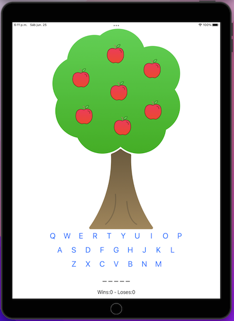

#  Apple pie

<h4 align="center">A simple word-guessing game for iPad</h4>

  •<a href="#key-features">Key Features</a>
  •<a href="#how-to-use">How To Use</a> 

## Code Quality Status
 
 
 
 
  

## Key Features

* UIKit
* MVC
* IBOutlets
* IBAction
* Structs
* Alert
* Closures

## How To Use

You have to guess a few words, chossing the available letters. The number of letters of each word is the same as the number of underscores. If you choose a letter that is not in the word to guess, an apple dissappears. In each word, if you guess the word, your wins increase in one but, if you lost all the apples, your loses increases one.

> **Note**
> The words are easy to guess 😉
